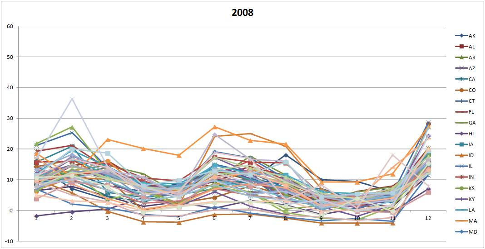
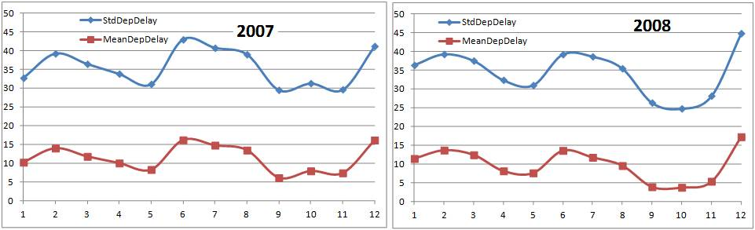
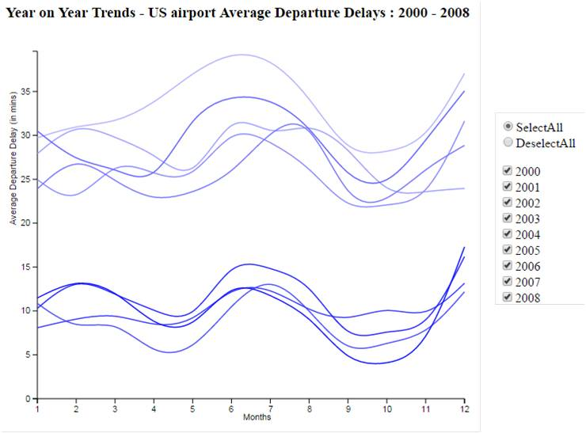

### Departure Delays at US airports 1988 to 2008
*Data analytics P6 udacity project*
*Raju Nanduri, December 2016*

**Summary**
Performance of flights is something which all of us inevitably experience. Hence I was keen to explore how to visualize this. 
To ilustrate this I choose to observe the year on year change of flight performance (focusing on departure delays) by exploring the month on month changes.
The resulting trend of average departure delays will allow to track any patterns across the months but also showcase the overall changes as the years go by.
The data set which contains information on United State flight delays and performance comes from RITA (http://stat-computing.org/dataexpo/2009/the-data.html).

**Design**
I started off first to understand the data provided. I initially tried to read the data using d3 to test the limits and as expected d3 is a visualization tool and not data munging (2008.csv file e.g. is ~650MB large). Hence I used pandas to crunch the data and used excel to render first static charts (see extractor.py and jpegs of the two excel charts). For the initial data set I choose the 2000 to 2008 year set. My code was data driven meaning that adding addl. years would not require recoding.

To show trends I opted for time series chart which would best capture possible changing dynamics in flight performance as a starting point.
Initially I wanted to show yearly trends of average flight departure delays grouped by US states. But the first sketch showed a very busy diagram 

Also animating this over the course of the years would be impractical to render and not have much value to the reader. Note: One approach would be to use a choropleth map with discrete color scale to show delay variations and animate over the years.

However wanting to stick to time series chart, I decided to show the trend across the US and not by state. Sketch for 2007 and 2008:

Note: Additionally and given I am showing averages across a large dataset I reviewed std deviation. A more interesting design would be to plot the std dev for each month as “halo” around the average monthly delay. This would make it more interesting to discren the mean.

For the viewer driven part of my visualization viewer selection of specific years will be enabled. This would also function as the legend.

To implement the visualization, I planned for two steps and corresponding feedback sessions post each step.
Step 1: code an author driven narrative by anminating the month of month changes over each year.
Step 2: provide reader to select a specific set of years to be able to observe the changes (TBD as of 24.12)

- Iteration 1: Coding the author driven narrative (based on 2000 to 2008 dataset for testing purpose)
- Iteration 2: Coding of the reader (based on 2000 to 2008 dataset for testing purpose)
- Iteration 3 (final): Integrate and also update data for the full set (1988 to 2008). Note: I excluded 1987 given it has only three months of data

**Feedback**
I gathered feedback from three different people with varying knowledge and exposure to data vizualization and charts. In a first pass, I let the reader review on his own. Then (some readers requested additional run of the anminations) I checked how intuitive the charts were to them by letting them explain what they took away from the graphics. Subsequently I prodded them to explain what would have helped them to come to the conclusions earlier. What parts of the charts needed changes. Specific feedback provided is shown with each iteration.

- Feedback Iteration 1 Author Driven Narrative - Initial:
-- *Overall*: Users intuitively understood the purpose of the chart. All observed the continues drop in average departure delay over the years. They also observed the broad pattern during the year with average delays being higher during year end holiday periods and then again during the summer.
-- *Transitions*: Fading out of previous year was too quick and users wanted to see both years in overlap to be able to compare the change. Also the fade in to went from dark to designate color however expected behavior was from nothing to designate color.
-- *Chart heading*: The year label which is updated during the transition was not easily picked up. Year label should transition along with year line.
-- *Chart label*: though I was due to code the legend but had deprioritized for the initial run, this was picked by all users as missing
-- *Chart quarter separators*: Add separators to highlight the quarters to allow easier observation of the timeperiods
-- *Chart other*: The title font type and axis font type differ. White background is too blank and to include background picture depicting departures. 
-- *Data*: One user wanted to also see total number of delays as a trend compared to average delay.

- Feedback Iteration 1 AuthorDriven Narrative - Final
-- Apart from the legend which I will be integrating with the viewer driven narrative my reviwers did not have any futher inputs beyond the suggested changes.

- Feedback Iteration 2 Viewer Driven Narrative - Initial:
-- *Overall* the ability to interact with the graphics was observed as a very ygood addition and made it more interesting for viewers
-- *Viewer menu*: One reviewer did not intuitely try out the checkboxes. Added heading accordingly
-- No other feedback or changes/updates were requested

- Feedback Iteration 3 Final Final:
-- *Overall* Comparing the decades mainly 1990s vs 2000 shows that in between 2000 to 2004 there is threefold jump in average departure delays. Especially the jump from 1999 to 2000 is significant (Y2K effect?). Further, the pronounced cyclical pattern of increase in average delays during year end and during mid of the year period starts to become more distintive from the late nineties.
-- *Year label*: Make the year label as chart is animated more prominent
-- *Viewer menu*: The heading on viewer menu to be bold to capture readers attention prodding them to play with the check boxes. 

**Resources**
[Flights data](http://stat-computing.org/dataexpo/2009/the-data.html) 
[D3 aninmations](http://www.jeromecukier.net/blog/2012/07/16/animations-and-transitions/) 
[D3 bind, update and exit](https://medium.com/@c_behrens/enter-update-exit-6cafc6014c36#.jui47gxej) 
[Color shades](http://www.w3schools.com/colors/colors_picker.asp)
